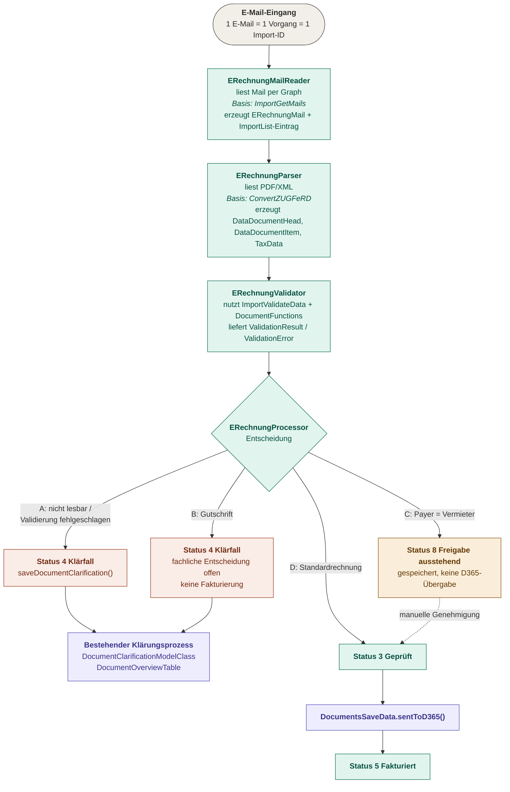

# Architektur eRechnungsverarbeitung

## Architekturprinzipien

- **Eine E-Mail entspricht genau einem Vorgang.**
- **Jede E-Mail erhält eine eigene Import-ID.**
- **Keine Sammel-PDFs und kein PDF-Merge mehr.**
- **Fehlerhafte Rechnungen blockieren keine anderen Rechnungen.**
- **Vorhandene Validierungslogik wird wiederverwendet** (`ImportValidateData`, `DocumentFunctions`).
- **Vorhandene D365-Schnittstelle wird wiederverwendet** (`DocumentsSaveData.sentToD365()`).
- **Vorhandene Klärfalllogik wird wiederverwendet** (`saveDocumentClarification()`).
- **Gutschriften werden bis zur fachlichen Entscheidung immer als Klärfall behandelt.**
- **Vermieter-Rechnungen werden nicht automatisch fakturiert**, sondern in einen Freigabeprozess überführt.

## Ablauf

Legende: grün = neu, lila = wiederverwendet, rot = Klärfall, gelb = Freigabe.

## Entscheidungslogik

| Fall | Bedingung | Status | Aktion |
|---|---|---|---|
| A | Rechnung nicht verarbeitbar oder Validierung fehlgeschlagen | 4 Klärfall | `saveDocumentClarification()`, erscheint im bestehenden Klärungsprozess |
| B | Dokumenttyp = Gutschrift | 4 Klärfall | Vorläufig immer Klärfall, fachliche Entscheidung offen, keine Fakturierung |
| C | Payer = Vermieter | 8 Freigabe ausstehend | Rechnung gespeichert, keine D365-Übergabe, wartet auf manuelle Genehmigung |
| D | Normale Rechnung ohne Fehler | 3 Geprüft → 5 Fakturiert | `DocumentsSaveData.sentToD365()` |

Die Fälle werden in der Reihenfolge A → B → C → D geprüft. Die erste zutreffende Bedingung bestimmt den Status.

## Komponenten

```mermaid
flowchart TB
    subgraph NEU["NEU"]
      direction TB
      PROC["ERechnungProcessor<br/><i>steuert Ablauf + Entscheidung</i>"]
      READER["ERechnungMailReader"]
      MAIL["ERechnungMail"]
      PARSER["ERechnungParser"]
      VALID["ERechnungValidator"]
      VRES["ValidationResult"]
      VERR["ValidationError"]
      STAT["ERechnungStatus<br/>3 · 4 · 5 · 8"]
    end
    subgraph BEST["BESTEHEND / WIEDERVERWENDET"]
      direction TB
      GET["ImportGetMails"]
      ZUG["ConvertZUGFeRD"]
      ILIST["ImportList"]
      HEAD["DataDocumentHead"]
      ITEM["DataDocumentItem"]
      TAX["TaxData"]
      IVD["ImportValidateData"]
      DF["DocumentFunctions"]
      D365["DocumentsSaveData.sentToD365()"]
      SDC["saveDocumentClarification()"]
      DCM["DocumentClarificationModelClass"]
      DOT["DocumentOverviewTable"]
    end
    subgraph WEG["ENTFÄLLT FÜR ERECHNUNG"]
      direction TB
      X1["ImportFileMerger"]
      X2["ImportFileHandler.mergeFiles()"]
      X3["Automatic.mergeFiles()"]
      X4["ImportRenameFile"]
      X5["ClarificationCasesInput.fxml"]
    end
    PROC --> READER
    PROC --> PARSER
    PROC --> VALID
    PROC --> STAT
    READER --> MAIL
    READER -. basiert auf .-> GET
    READER --> ILIST
    PARSER -. basiert auf .-> ZUG
    PARSER --> HEAD
    PARSER --> ITEM
    PARSER --> TAX
    VALID --> IVD
    VALID --> DF
    VALID --> VRES
    VRES --> VERR
    PROC -->|"A / B"| SDC
    PROC -->|"D"| D365
    SDC --> DCM
    DCM --> DOT

    classDef neu fill:#E1F5EE,stroke:#0F6E56,color:#085041
    classDef best fill:#EEEDFE,stroke:#534AB7,color:#3C3489
    classDef weg fill:#F1EFE8,stroke:#888780,color:#5F5E5A,stroke-dasharray:4 3
    class PROC,READER,MAIL,PARSER,VALID,VRES,VERR,STAT neu
    class GET,ZUG,ILIST,HEAD,ITEM,TAX,IVD,DF,D365,SDC,DCM,DOT best
    class X1,X2,X3,X4,X5 weg
```

## Verantwortlichkeiten

### Neu

| Klasse | Verantwortung |
|---|---|
| `ERechnungProcessor` | Steuert den Ablauf pro E-Mail und trifft die Entscheidung A–D |
| `ERechnungMailReader` | Liest E-Mails per Microsoft Graph (Basis: `ImportGetMails`), vergibt die Import-ID |
| `ERechnungMail` | Datenobjekt einer E-Mail: Absender, Betreff, Empfangsdatum, Anhänge, Import-ID |
| `ERechnungParser` | Liest PDF/XML (Basis: `ConvertZUGFeRD`), erzeugt `DataDocumentHead`, `DataDocumentItem`, `TaxData` |
| `ERechnungValidator` | Führt die bestehenden Prüfungen aus `ImportValidateData` und `DocumentFunctions` aus |
| `ValidationResult` | Ergebnis der Validierung: gültig ja/nein, Liste der Fehler |
| `ValidationError` | Einzelner Fehler mit Feld, Meldung und Ursache |
| `ERechnungStatus` | Status-Enum: 3 Geprüft, 4 Klärfall, 5 Fakturiert, 8 Freigabe ausstehend |

### Bestehend / wiederverwendet

| Klasse | Verwendung |
|---|---|
| `ImportGetMails` | Graph-Logik als Grundlage für `ERechnungMailReader` |
| `ConvertZUGFeRD` | XML-Lese-Logik als Grundlage für `ERechnungParser` |
| `ImportList` | Ein Eintrag pro E-Mail mit eigener Import-ID |
| `DataDocumentHead`, `DataDocumentItem`, `TaxData` | Unverändertes Dokumentmodell |
| `ImportValidateData`, `DocumentFunctions` | Bestehende fachliche Prüfungen |
| `DocumentsSaveData.sentToD365()` | Übergabe an D365 und Fakturierung |
| `saveDocumentClarification()` | Anlage des Klärfalls |
| `DocumentClarificationModelClass` | Datenmodell des Klärfalls |
| `DocumentOverviewTable` | Anzeige der Vorgänge im bestehenden Prozess |

### Entfällt für eRechnung

| Klasse | Grund |
|---|---|
| `ImportFileMerger` | Keine Sammel-PDFs mehr |
| `ImportFileHandler.mergeFiles()` | Kein PDF-Merge mehr |
| `Automatic.mergeFiles()` | Kein PDF-Merge mehr |
| `ImportRenameFile` | Datei wird nicht mehr für Sammelimporte umbenannt |
| `ClarificationCasesInput.fxml` | Keine manuelle Seitenauswahl für Klärfälle mehr |

Diese Klassen entfallen nur für den eRechnungs-Pfad. Solange es noch Papier- oder Nicht-eRechnungen gibt, bleiben sie für diese Fälle bestehen.
