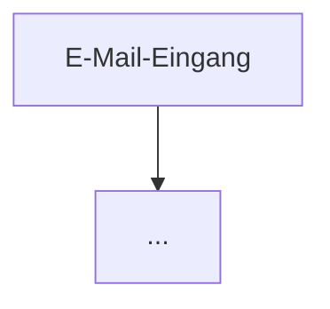

flowchart TD
    A[E-Mail-Eingang] --> B[E-Mail einlesen Metadaten + Anhänge]
    B --> C{Format unterstützt und lesbar?}
    C -- Nein --> K1[Klärfall technischer Fehler]
    C -- Ja --> D[Daten ins Dokumentmodell]
    D --> E[Befunde erheben Belegart · Validierung · Dublette · Vermieter]
    E --> F{Validierung ok?}
    F -- Nein --> K2[Klärfall fachlicher Fehler]
    F -- Ja --> G{Dublette?}
    G -- Ja --> K3[Klärfall Dublettenverdacht]
    G -- Nein --> H{Gutschrift?}
    H -- Ja --> K4[Klärfall Gutschrift]
    H -- Nein --> I{Vermieter?}
    I -- Ja --> P[Freigabepool Freigabe ausstehend]
    I -- Nein --> S[Status: Geprüft]
    P -. nach Freigabe .-> S
    S --> X[Übergabe D365 Fakturierung]

    classDef klaer fill:#FAECE7,stroke:#993C1D,color:#712B13
    classDef frei fill:#FAEEDA,stroke:#854F0B,color:#633806
    classDef ok fill:#E1F5EE,stroke:#0F6E56,color:#085041
    class K1,K2,K3,K4 klaer
    class P frei
    class S,X ok
    

