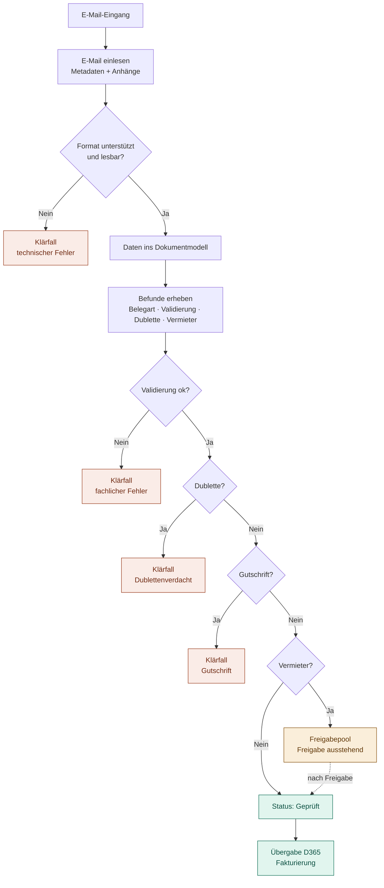

# Zielkonzept eRechnungsverarbeitung

Ziel ist eine vollständig automatisierte Verarbeitung elektronischer Rechnungen, bei der jeweils eine einzelne E-Mail die Verarbeitungseinheit ist.

Anders als heute werden keine PDF-Dateien mehr zusammengeführt und keine Sammelimporte mehr erzeugt. Jede eingehende E-Mail ist ein eigenständiger Vorgang und wird unabhängig von anderen Rechnungen verarbeitet.

## Zielbild

## Verarbeitungsablauf

1. Eine E-Mail mit eRechnungs-Anhang geht ein.
2. Das System liest die E-Mail und übernimmt Absender, Betreff, Empfangsdatum und Anhänge.
3. Das System prüft, ob ein unterstütztes eRechnungsformat vorliegt (ZUGFeRD, Factur-X, XRechnung, UBL oder CII).
4. Die Rechnungsdaten werden ausgelesen und in das bestehende Dokumentmodell übernommen.
5. Das System erhebt alle Befunde vollständig, bevor es entscheidet.
6. Die Geschäftsregeln werden in fester Priorität angewendet.

## Befunderhebung

Vor der Entscheidung werden alle Prüfungen ausgeführt und ihre Ergebnisse gesammelt. Die Verarbeitung bricht nicht beim ersten Treffer ab.

| Befund | Prüfung |
|---|---|
| Belegart | Rechnung oder Gutschrift, z. B. über den TypeCode (380 = Rechnung, 381 = Gutschrift) |
| Validierung | Dieselben Prüfregeln, die heute über den Button „Geprüft“ ausgelöst werden |
| Dublette | Gleicher Lieferant und gleiche Rechnungsnummer bereits vorhanden |
| Vermieter | Die Rechnung gehört zu einem Vermieterprozess |

Die Belegart wird direkt nach dem Einlesen bestimmt. Viele Validierungsregeln sind auf Rechnungen ausgelegt und würden bei Gutschriften fälschlich fehlschlagen, etwa bei negativen Beträgen.

Ein Klärfall enthält dadurch alle erkannten Gründe auf einmal, nicht nur den ersten.

## Entscheidungslogik

Die Regeln werden in dieser Reihenfolge angewendet. Die erste zutreffende Regel bestimmt den Status. Keine spätere Regel darf eine Rechnung in einen „besseren“ Status bringen, wenn eine frühere Regel sie aufhalten müsste.

| Priorität | Regel | Ergebnis |
|---|---|---|
| 1 | Technischer Fehler (Format nicht unterstützt oder nicht lesbar) | Klärfall, Status: Klärung |
| 2 | Fachlicher Fehler (mindestens eine Validierung schlägt fehl) | Klärfall, Status: Klärung |
| 3 | Dublettenverdacht (Lieferant + Rechnungsnummer bereits vorhanden) | Klärfall, Status: Klärung |
| 4 | Gutschrift | Klärfall, Status: Klärung |
| 5 | Vermieter-Rechnung | Freigabepool, Status: Freigabe ausstehend |
| 6 | Standardrechnung (Fallback) | Status: Geprüft, Übergabe an D365 |

### Klärfälle (Priorität 1–4)

- Status: Klärung, mit gespeichertem Klärgrund
- Originaldatei bleibt erhalten
- Alle erkannten Fehler werden gespeichert
- Keine Fakturierung
- Bei Dubletten: Verweis auf den bestehenden Vorgang

Die Gutschrift-Regel steht bewusst vor der Vermieter-Regel. Eine Vermieter-Gutschrift wird dadurch zum Klärfall und landet nicht im Freigabepool. Die Behandlung elektronischer Gutschriften ist fachlich noch nicht abschließend definiert, bis dahin ist eine manuelle Bearbeitung erforderlich.

### Vermieter-Rechnung (Priorität 5)

- Status: Freigabe ausstehend
- Keine Übergabe an D365
- Nach der Freigabe Weiterverarbeitung wie eine Standardrechnung

### Standardrechnung (Priorität 6)

- Status: Geprüft
- Übergabe an D365 und Fakturierung gemäß den bestehenden Prozessen

## Wesentliche Vorteile

- Eine E-Mail entspricht genau einem Vorgang.
- Fehlerhafte Rechnungen blockieren keine anderen Rechnungen.
- Kein PDF-Merging und keine manuelle Seitenauswahl für Klärfälle mehr.
- Große Teile der bestehenden Validierungs- und D365-Logik werden wiederverwendet.
- Feste Prüfreihenfolge sorgt für eindeutige Ergebnisse, auch bei mehreren Befunden.
- Klärfälle enthalten alle Klärgründe auf einmal.
- Die Dublettenprüfung schützt vor Doppelfakturierung.
- Vollständige Nachvollziehbarkeit über den gesamten Lebenszyklus einer Rechnung.

## Offene Punkte

- [ ] Fachliche Definition der Gutschrift-Behandlung
- [ ] Dublettenerkennung: nur Lieferant + Rechnungsnummer, oder zusätzlich Betrag und Datum?
- [ ] Wer gibt Vermieter-Rechnungen frei? Gibt es eine Frist oder Eskalation?
- [ ] E-Mails mit mehreren eRechnungen: ein Vorgang oder mehrere?
